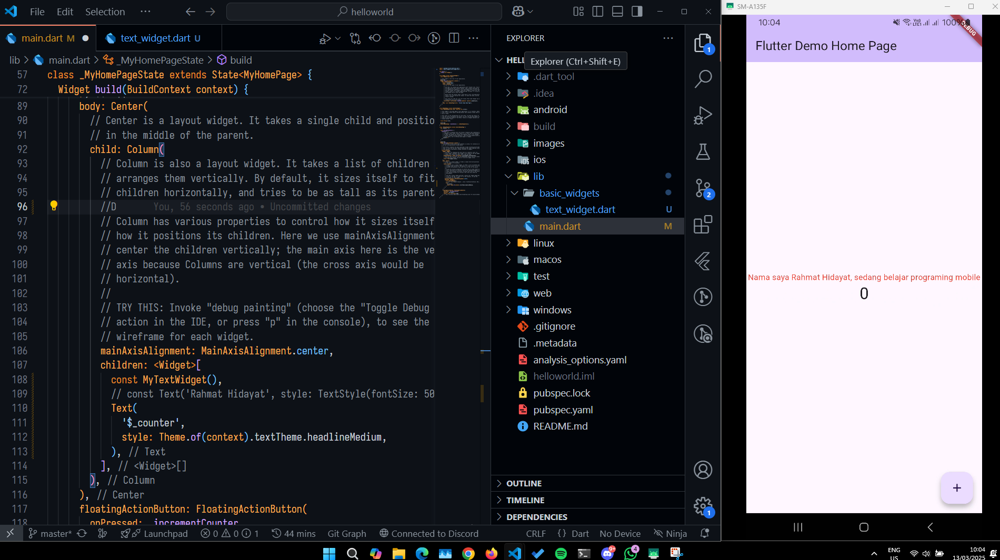
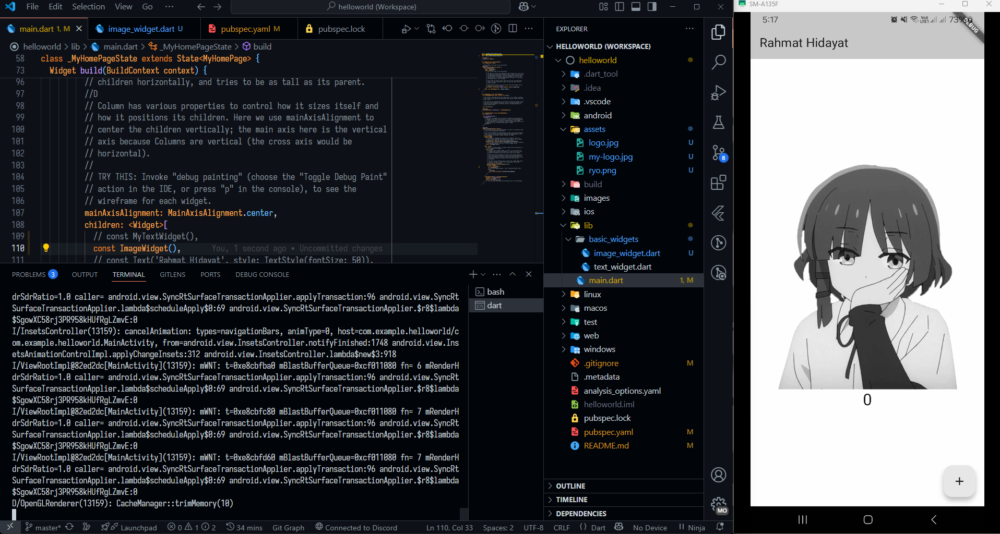
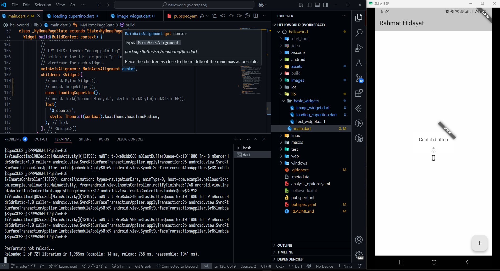
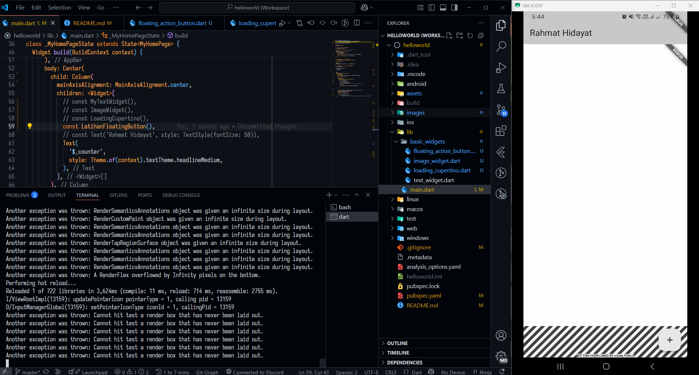
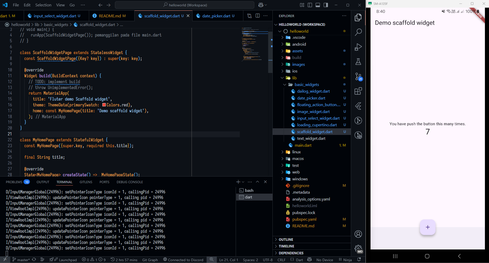
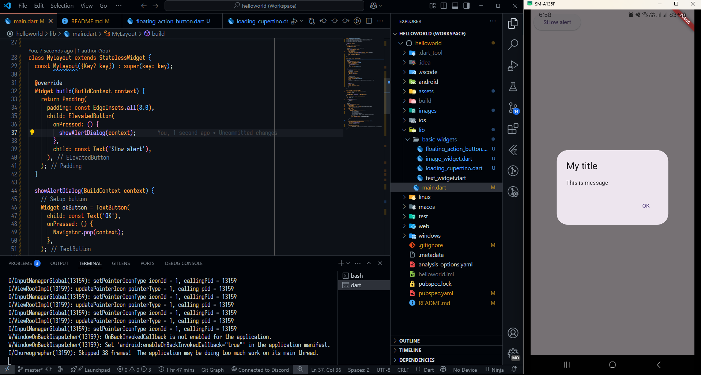
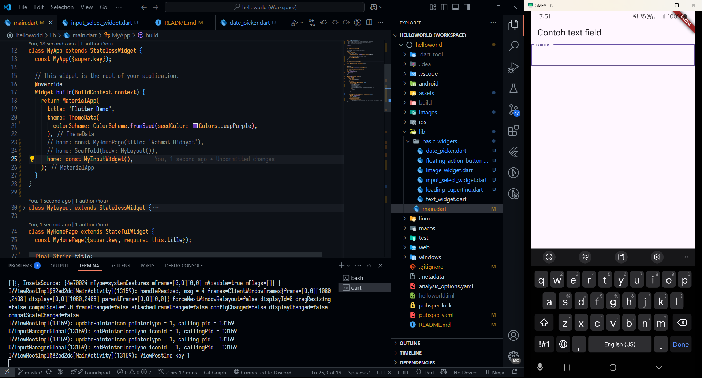
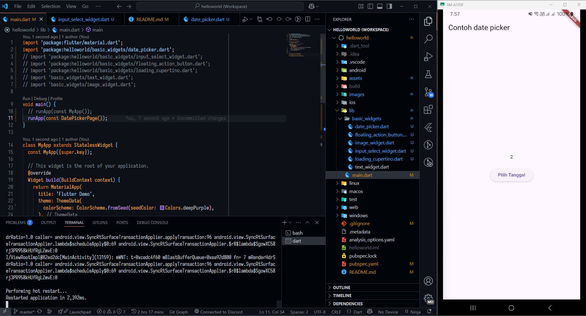
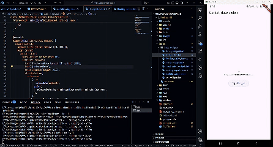

# Hello world project

A new flutter project.
## Praktikum 3

## Praktikum 4
Berikut merupakan hasil dari textWidget

## Image Widget
Berikut merupakan hasil dari image widget

## Cupertino Loading
berikut merupakan cupertino loading

## Floating Action button
berikut merupakan floating action button

## Scafold Widget
Berikut merupakan Scaffold component

## Dialog Widget
Berikut merupakan dialog component

## Input widget
Berikut merupakan contoh input widget component

## Date widget
Berikut merupakan contoh date widget component beserta GIF

